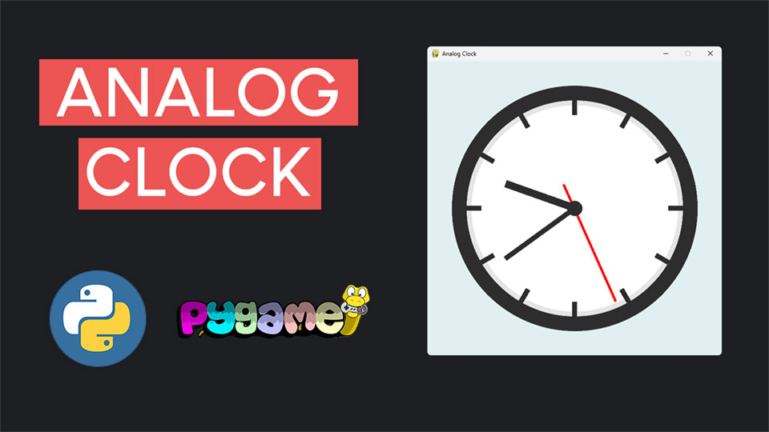

# Reloj analógico con Python y Pygame

Este repositorio contiene el código sobre cómo crear un reloj analógico completamente funcional con Python y Pygame.

## Descripción general

En este tutorial, construimos un hermoso reloj analógico desde cero con Python y Pygame. El tutorial lo guía a través de cada paso del proceso, desde la configuración del proyecto hasta la creación de componentes de reloj y la implementación de actualizaciones en tiempo real.

<p align="center">
  
</p>
<br>

## Características

- **Esfera de reloj personalizable:** Aprenda a crear una esfera de reloj de aspecto profesional con un borde exterior, marcadores de hora y un diseño pulido.
- **Manecillas de reloj dinámicas:** Cree manecillas de hora, minutos y segundos que giren en tiempo real.
- **Programación orientada a objetos (POO):** El proyecto está estructurado utilizando principios de POO para mantener el código modular y organizado.
- **Gráficos suaves:** Utilice anti-aliasing para crear componentes visualmente atractivos sin bordes irregulares.

## Estructura del código

- **analog.py:** Contiene la clase `AnalogClock`, que se encarga de dibujar la esfera del reloj, las manecillas y las actualizaciones en función de la hora actual.
- **clock.py:** El script principal que inicializa la ventana de Pygame, actualiza el reloj y lo muestra en la pantalla.

## Cómo ejecutar

1. Clona este repositorio:
```bash
git clone https://github.com/nvarona/analog-clock-pygame.git
cd analog-clock-pygame
```

2. Asegúrate de tener instalados Python y Pygame. Instala Pygame usando pip:
```bash
pip install pygame
```

3. Ejecuta el script `clock.py`:
```bash
python clock.py
```

## Pasos del proyecto

Este proyecto se divide en 8 pasos:
1. **Instala Pygame** - Configura tu entorno e instala la biblioteca Pygame.
2. **Crear la ventana y el bucle principal**: configure la ventana de Pygame y su bucle principal.
3. **Dibujar la esfera del reloj**: cree el borde exterior, el borde interior y la esfera del reloj.
4. **Agregar marcadores de hora**: diseñe y coloque 12 marcadores de hora espaciados uniformemente.
5. **Crear el minutero**: dibuje y gire el minutero según la hora actual.
6. **Crear la manecilla de la hora**: construya la manecilla de la hora con rotación proporcional.
7. **Crear el segundero**: agregue el segundero con un desplazamiento preciso y una rotación suave.
8. **Obtener la hora real**: use el módulo `datetime` de Python para obtener la hora actual y actualizar el reloj.

1. Instalacion de la libreria pygame si no la tienes:

$ pip install pygame-ce

2. El Main Loop contara de tres partes:
    - Event Handling
    - Updating
    - Drawing Objects
    El Loop lo ejecutaremos unos 15 FPS que es susfiente para el proyecto.

3. Los colores en PyGame son con este formato:
    color = (red, green, blue)
    con valores entre 0 y 255 ( 0 = ausencia de color, y 255 representa maxima intensidad)
    Por ejemplo:
    red = (255, 0, 0)

4. Compontes que devemos dibujar en la pantalla:
    - Esfera exterior con las indicaciones de cada hora
    - Manecillas en negro de minutos y horas
    - Manecilla de segundos en rojo
    - punto central del reloj
4. Para los marcadores de las horas, tendremos 12 marcadore, que los hiremos rotando cada 30 grados cada uno

5.  **Minutero:**La esfera del reloj es un circulo completo dividido en 60 minutos.
    Cada minuto corresponde a una porcion igual del circulo: 6 grados por minuto.
    Eso signigfica que el minutero se mueve en el sentido de las agujas del reloj
    6 grados por cada minuto que pasa. Para calcular el angulo exacto del minuto actual
    multiplicaremos el valor del minuto por 6.
    Sin embargo, dado que el metodo de rotacion de PyGmae gira las superfices en sentido antihorario de manera predeterminada, necesitamos aplicar un angulo negativo para lograr una rotacion en el sentido de las agujas del reloj.

6.  **Hora:** Ahora para la marca o manecilla de la hora lo que va a ser mas corta y mas grusa que el minutero.
    Lo que vamos a hacer es una visualizacion diferente. Este rectangulo se extendera desde el centro del reloj y apuntara a la marca de hora apropiada en la esfera del reloj. La diferencia clave radica en como calculamos el angulo de rotacion de la manecilla de la hora. Como la manecilla de la hora que represnta 12 horas en el reloj, el circulo completo de 360 grados se divide en 12 partes: esto significa que por cada hora, la manecilla de la hora gira 30 grados. Sin embargo la manecilla de la hora no salta directamente de una hjora a la siguiente, sino que se mueve gradualmente a medida que avanza el tiempo.
    Para lograr esta transicion suave, tambien consideramos la fraccion de la hora actual en funcion de los minutos.
    Por ejemplo:
    - exactamente a las 3:00, la manecilla de la hora apunta a 90 grados (3 x 30 grados).
    - a las 3:30, la manecilla de la hora señala la mitad del camino entre 90 grados y 120 grados (3 x 30 grados + 15 grados de los minutos) = 105 grados.
    Formula: Rotation Angle = 30 x hour + (minute / 60) * 30

7. **Secundero:** en una superficie separada y rotaremos esa superfice cada segundo. Vamos a hacerlo..
    Veremos que en la primera iteracion esta un poco desfasado. Actualmente el secuendero gira desde su borde izquierdo, lo cual no es correcto. Debe girar desde un punto ligeramente, desplazado entre el borde izquierdo y su centro.
    Para solucionar esto, introduciremos un pequeno desplazamiento en el eje y al posicionar el rectangulo del secuendero en la superfice de rotacion. Este desplazamiento garantizara que el secuendero gire desde su punto de pivote previsto.
    Para lograr esto, modificaremo el metodo __draw_hand().

8. **Hora del sistema y update**: ahora nos toca el final, coger la hora del sistema y pintar ...


## Dependencias

- Python 3.x
- Pygame

## Contribuciones

¡Las contribuciones son bienvenidas! Si tiene ideas para mejoras o funciones adicionales, no dude en abrir un problema o enviar una solicitud de incorporación de cambios.

## Licencia

Este proyecto está licenciado bajo la licencia MIT. Consulta el archivo de LICENCIA para obtener más detalles.

¡Disfruta codificando tu reloj analógico y no olvides compartir tus proyectos! 🚀

# Enlaces de Interes

<br>
<p align="center">
| 📺 <a href="https://nvarona.x10.bz/">My Web Personal Channel</a>
| 🌍 <a href="https://nvarona.x10.bz/blog">My Blog Website</a> | 2025 |<br>
</p>
